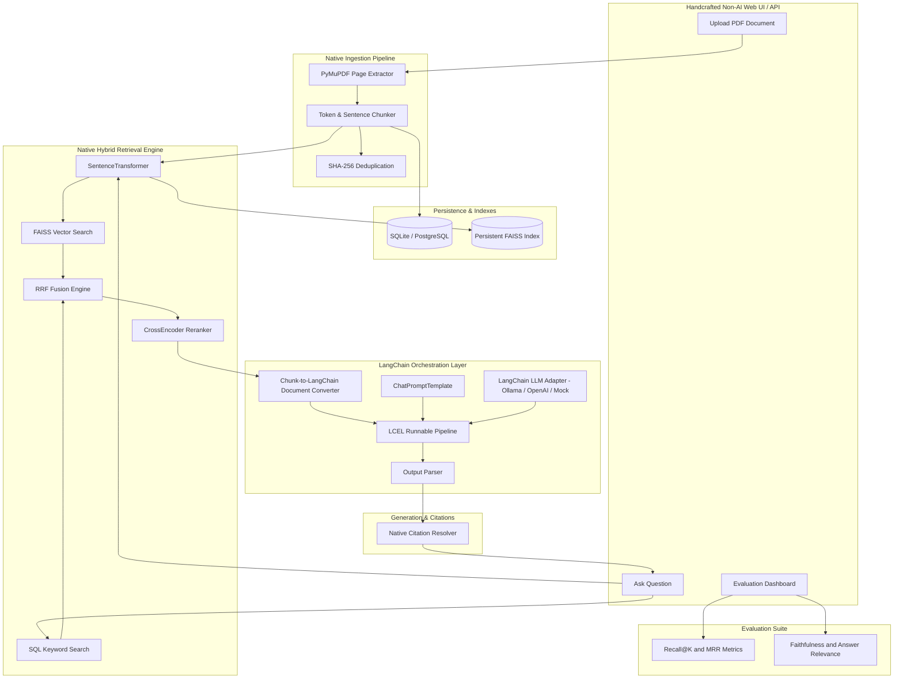

# Enterprise Document Intelligence & RAG Assistant

A production-style **Enterprise Document Intelligence & RAG Assistant** built with Python, FastAPI, PyMuPDF, Sentence Transformers, persistent FAISS vector store, SQL-backed keyword search, Reciprocal Rank Fusion (RRF) hybrid retrieval, CrossEncoder reranking, **LangChain LCEL Orchestration**, local Ollama / OpenAI LLM providers, grounding citations, and an empirical RAG evaluation suite.

---

## 🎯 Problem

Enterprise documents (employee handbooks, financial disclosures, security policies, technical specifications) are often stored in complex PDFs. Standard search tools and basic vector-only RAG pipelines face two major challenges:

1. **Exact Identifiers & Policy Codes Misses**: Vector embeddings often fail on specific policy codes, employee IDs, product SKUs, and acronyms (e.g., `HR-204`, `SEC-402`, `FIN-901`).
2. **LLM Hallucinations**: Standard LLMs often fabricate details when context is missing, leading to inaccurate enterprise answers without verifiable page citations.

---

## 🚀 Solution Architecture

This application addresses these challenges through a hybrid retrieval pipeline with LangChain LCEL orchestration:
- **Native Page-Aware PDF Ingestion**: Extracts text page-by-page preserving document name, page number, and SHA-256 deduplication hash.
- **Native Hybrid Semantic + Keyword Search**: Combines FAISS cosine vector search with SQL keyword search via **Reciprocal Rank Fusion (RRF)**.
- **Native CrossEncoder Reranking**: Refines candidate contexts before prompt construction.
- **LangChain LCEL Orchestration**: Converts retrieved chunks into LangChain `Document` objects, formats context via `ChatPromptTemplate`, executes the LCEL Runnable pipeline (`Prompt | LLMAdapter | OutputParser`), and parses generated outputs.
- **Provider Support (Ollama / OpenAI / Mock)**: Native integration with local Ollama models (`llama3`, `mistral`), OpenAI REST API, and offline Mock fallback.
- **Grounded LLM Generation**: Instructs the LLM to strictly cite document sources and page numbers, returning refusal messages when information is absent.
- **Quantitative RAG Evaluation**: Evaluates retrieval (`Recall@1`, `Recall@3`, `Recall@5`, `Recall@10`, `MRR`) and generation (`Faithfulness`, `Answer Relevance`).

---

## 🏗️ Architecture Diagram



---

## 🎨 Non-AI Human UI Design System

To ensure the interface avoids generic "AI design tells" (indigo/purple gradient overload, excessive glassmorphism blur, hyper-rounded pill cards `rounded-2xl`, and generic sparkle icons), the web UI was engineered with a **human-crafted, high-density enterprise design aesthetic**:

- **Sharp & Subtle Geometry**: Clean `rounded-md` / `rounded-sm` corners (4px–6px radii) for precision.
- **Engineered Neutral Palette**: High-contrast dark slate & neutral tones (`bg-[#090d16]`, `border-[#1e293b]`, `bg-[#0f172a]`).
- **Structured Monospace Metadata**: Monospaced status indicators, RRF scores, page tags, and latency statistics.

---

## 🦙 Ollama Local LLM Integration

The application automatically connects to local Ollama instances (`http://localhost:11434`):

```bash
# Pull and serve local Ollama model
ollama pull llama3
ollama run llama3
```

When Ollama is running locally, the system automatically detects installed models and routes RAG generation through `OllamaLLMProvider`. If Ollama is offline and no `LLM_API_KEY` is provided, the system seamlessly falls back to the built-in offline Mock LLM provider.

---

## 🛠️ Technology Stack

| Category | Technology |
|---|---|
| **Backend Framework** | Python 3.11+, FastAPI, Uvicorn, Pydantic v2, SQLAlchemy |
| **Orchestration** | LangChain (`langchain-core`, LCEL Runnable Chains, ChatPromptTemplate, StrOutputParser) |
| **PDF Extraction** | PyMuPDF (`fitz`) - Page-aware text extraction |
| **Embeddings** | SentenceTransformers (`all-MiniLM-L6-v2`) |
| **Vector Indexing** | FAISS (`faiss-cpu`) - Inner Product on L2 Normalized Vectors |
| **Keyword Search** | Database-backed SQL term frequency & phrase matching |
| **Hybrid Fusion** | Reciprocal Rank Fusion (RRF) |
| **Reranking** | CrossEncoder (`cross-encoder/ms-marco-MiniLM-L-6-v2`) |
| **LLM Interface** | Provider-Agnostic Abstraction (Ollama Local, OpenAI REST API, Offline Mock Engine) |
| **Frontend UI** | HTML5, Vanilla JavaScript (ES6), Tailwind CSS CDN, Chart.js |
| **Containerization** | Docker & Docker Compose |

---

## 📁 Project Structure

```text
document_analasis/
├── backend/
│   ├── app/
│   │   ├── main.py                # FastAPI app entry point & static file routing
│   │   ├── api/                   # REST API routes (documents, query, evaluation, health)
│   │   ├── core/                  # App configuration & structured logging
│   │   ├── db/                    # SQLAlchemy models, database session, repositories
│   │   ├── ingestion/             # PyMuPDF loader, sentence chunker, metadata enricher
│   │   ├── embeddings/            # SentenceTransformer embedding service
│   │   ├── retrieval/             # FAISS store, SQL keyword search, RRF hybrid fusion, reranker
│   │   ├── langchain/             # LangChain LCEL chain, prompt templates, Document adapter
│   │   ├── generation/            # LLM provider abstraction (Ollama, OpenAI, Mock)
│   │   ├── rag/                   # Central RAG pipeline orchestrator
│   │   ├── evaluation/            # Recall@K, MRR, Faithfulness, Answer Relevance metrics
│   │   └── schemas/               # Pydantic request/response validation schemas
│   ├── tests/                     # Pytest unit & integration test suite
│   ├── requirements.txt           # Python dependencies
│   └── Dockerfile                 # Backend container definition
├── frontend/
│   └── index.html                 # Non-AI enterprise single-page web dashboard
├── data/
│   ├── documents/                 # PDF document storage
│   ├── indexes/                   # FAISS index and metadata storage
│   ├── evaluation/                # Sample evaluation benchmark dataset
│   └── test_docs/                 # Generator scripts for real test PDF documents
├── docker-compose.yml             # Docker multi-container orchestrator
├── .env.example                   # Environment configuration template
└── README.md                      # Project documentation
```

---

## ⚡ Quickstart & Installation

### 1. Local Development

```bash
python3 -m venv .venv
source .venv/bin/activate
pip install -r backend/requirements.txt
```

Start Application Server:
```bash
PYTHONPATH=backend uvicorn app.main:app --host 0.0.0.0 --port 8000 --reload --app-dir backend
```

- Access Web Dashboard: [http://localhost:8000](http://localhost:8000)
- OpenAPI Specification: [http://localhost:8000/docs](http://localhost:8000/docs)

---

### 2. Docker Deployment

```bash
docker compose up --build
```

---

## 💡 Real Working Example Request & Response

Execution of `SEC-402` query over the generated 3-page test PDF document `acme_enterprise_security_and_hr_policy_2026.pdf`:

### Query Request
`POST /api/query`
```json
{
  "question": "What are the remote work security requirements under policy SEC-402?",
  "top_k": 5,
  "enable_reranking": true
}
```

### Real Response Payload
```json
{
  "query_id": 16,
  "question": "What are the remote work security requirements under policy SEC-402?",
  "answer": "Based on the provided documents: All employees accessing ACME production databases, internal code repositories, or customer data remotely must connect exclusively through the ACME Enterprise Zero-Trust VPN gateway. Multi-Factor Authentication (MFA) is mandatory across all enterprise accounts. [acme_enterprise_security_and_hr_policy_2026.pdf, Page 2]",
  "answer_found": true,
  "sources": [
    {
      "document_id": 1,
      "document_name": "acme_enterprise_security_and_hr_policy_2026.pdf",
      "page_number": 2,
      "chunk_id": 2,
      "score": 5.3488
    }
  ],
  "retrieval_metadata": {
    "semantic_count": 3,
    "keyword_count": 3,
    "hybrid_candidate_count": 3,
    "final_context_count": 3,
    "reranking_enabled": true,
    "retrieved_chunks": [
      {
        "chunk_id": 2,
        "document": "acme_enterprise_security_and_hr_policy_2026.pdf",
        "page": 2,
        "rrf_score": 0.0163934,
        "rerank_score": 5.34879,
        "text": "ACME Global Corporation · Enterprise Policy Handbook (2026 Edition)\nSection 2: Information Security & Remote Work Infrastructure\nPolicy Reference Code: SEC-402..."
      }
    ]
  },
  "performance": {
    "retrieval_ms": 42.1,
    "generation_ms": 12.42,
    "total_ms": 54.52
  }
}
```

---

## 📊 Evaluation Framework

The system includes a quantitative evaluation framework:

- **Recall@K ($K \in \{1, 3, 5, 10\}$)**: Measures whether relevant ground-truth chunks appear in top $K$ results.
- **Mean Reciprocal Rank (MRR)**: Evaluates the position of the first relevant chunk in retrieved candidates:
  $$MRR = \frac{1}{|Q|} \sum_{i=1}^{|Q|} \frac{1}{\text{rank}_i}$$
- **Faithfulness**: Measures whether claims in the generated answer are grounded in context chunks.
- **Answer Relevance**: Measures lexical overlap between the user question and the answer.
